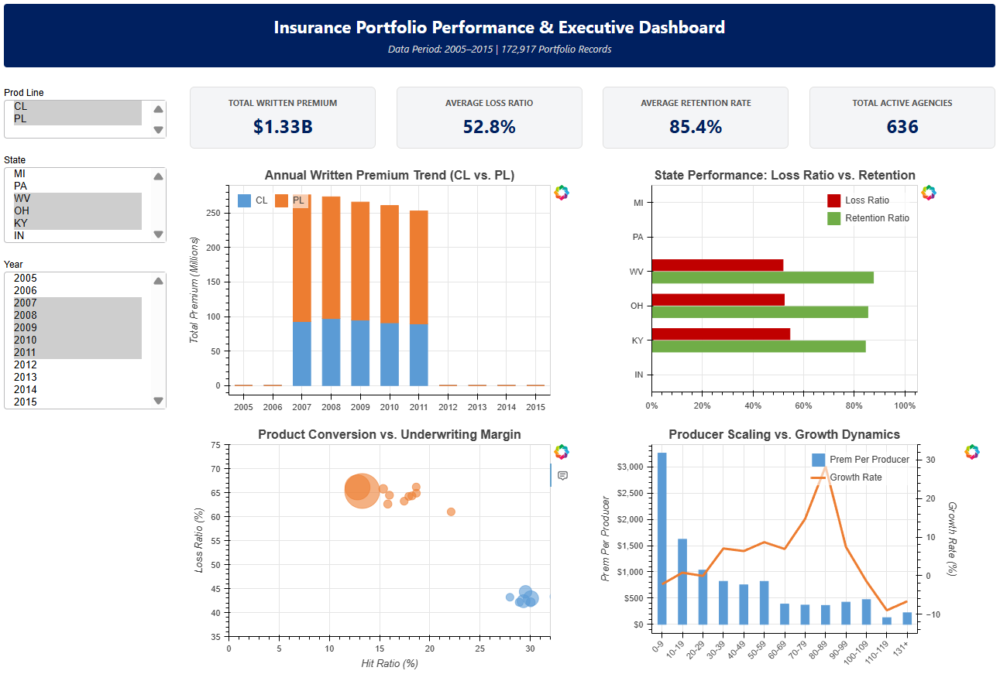

# insurance-dashboard


A full-stack data analytics and visualization project showcasing an end-to-end data pipeline, financial spreadsheet modeling, and a responsive, full-width interactive Python Bokeh web application.


## **📋Project Overview**


This project processes 213,000 multi-year Kaggle insurance records (2005–2015) to analyze and evaluate core underwriting and business performance metrics. It tracks key performance indicators—including written premiums, loss ratios, retention rates, hit ratios, and producer scaling dynamics—across multiple regional US markets (MI, PA, WV, OH, KY, IN) and product lines (commercial and personal).





## **🗂️ Repository Structure**


```text
insurance-dashboard/
│
├── data/
│   ├── insurance_api.csv          		    # Raw data extracted from Kaggle API
│   └── insurance_data_clean.csv   		    # Cleaned, standardized, and validated dataset
│
├── analysis/
│   └── api_cleanup.ipynb          		    # Jupyter notebook for data wrangling and transformation
│
├── docs/
│   ├── generate_html_dashboard.py          # Python script compiling Bokeh layouts, CSS, and JS callbacks
│   ├── Insurance_Dashboard_Excel.xlsx	    # Excel model containing pivot tables & metrics
│   └── index.html             			    # Fully interactive, standalone generated dashboard
│
├── images/
│   └── dashboard_preview.png         		# Image of example dashboard
│
├── requirements.txt
├── LICENSE.txt
└── README.md
```


## **🛠️ Skills Demonstrated**

* **Python**: Data wrangling, normalization, and automated pipelines via Pandas.
* **Data Visualization**: Bokeh (featuring custom client-side CustomJS filtering callbacks and dual-axis charts).
* **Spreadsheet Modeling**: Microsoft Excel (Pivot tables, exploratory data analysis, metric validation).


## **📈 Key Dashboard Features**


* **Executive KPI Block**: Real-time summary cards displaying Total Written Premium (in Billions), Average Loss Ratio, Average Retention Rate, and Total Active Agencies.
* **Interactive Multi-Select Filters**: Dynamic filtering by Product Line (CL, PL), State, and Year that recalculates metrics and updates all underlying graphs instantaneously without page reloads.
* **Multi-Series Stacked Bar Chart**: Tracks annual written premium trends broken down by commercial and personal lines.
* **State-Level Comparative Analysis**: Horizontal bar chart comparing average loss ratios against retention ratios across target states.
* **Bubble Chart Analytics**: Evaluates product conversion rates (Hit Ratios) against underwriting margins (Loss Ratios) with dynamic sizing weighted by total premium volume.
* **Producer Scaling Dynamics**: Dual-axis chart measuring productivity brackets (premium per producer) alongside unified growth rates.


## **🌐 Live Demo**


You can view and interact with the live dashboard directly in your browser without installing any code:

👉 [Interactive Dashboard](https://rish-s7.github.io/insurance-dashboard/)


## **🚀 How to Run Locally**


If you want to run or regenerate the dashboard on your local machine, follow these steps:


Clone the repository:


```bash

git clone https://github.com/rish-s7/insurance-dashboard.git

cd insurance-dashboard

```


Install dependencies:


```bash

pip install -r requirements.txt

```


Run the dashboard generator script:


```bash

python dashboard/generate_html_dashboard.py

```


View the dashboard:

Open dashboard/index.html directly in any modern web browser to interact with the application.

